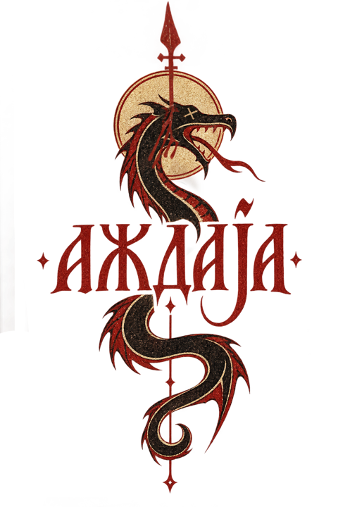

<p align="center"></p>

# azdaja

**A fast recursive-language-model layer for long contexts.**

Azdaja keeps the full input inside a persistent, sandboxed Monty/Python evaluator. A root model writes compact analysis code; semantic work is delegated through `llm` and `llm_batch`; deterministic reduction happens locally.

> v0.1.0 prerelease. The CLI and initial Apple Silicon macOS install path are end-to-end tested. Benchmark results below are diagnostics, not a product gate or superiority claim.

## Why

Long-context agents repeatedly reread, copy, and reason over the same input. Azdaja separates the work:

1. `load` places the complete UTF-8 input in a persistent evaluator.
2. Python performs exact parsing, filtering, grouping, and reduction.
3. Model calls handle only semantic predicates.
4. Strict manifests enforce complete ID coverage before `FINAL` is accepted.

The model-facing surface is deliberately small:

```python
llm(prompt, model=None, ctx="")
llm_batch(prompts, model=None, workers=2)
FINAL(answer)
FINAL_VAR("variable_name")
```

`solo` additionally preloads `semantic_manifest(items, task, labels)`: two blind independent full manifests, strict validation, and one blind complete adjudication of every disagreement within a preflighted call envelope.
`solo` treats a blank string passed to `FINAL` as an incomplete terminal answer and spends only its remaining bounded same-session correction budget; tasks whose intended answer is blank are therefore unsupported by `solo`.

## Install

The v0.1.0 prerelease provides one-command installation for Apple Silicon macOS:

```bash
curl -fsSL https://raw.githubusercontent.com/kubet/azdaja/v0.1.0/site/install | sh
```

The versioned installer downloads only the immutable `azdaja-v0.1.0-darwin-arm64` release asset, requires SHA-256 `6b50716382ac35e4f2bc9fc3c1cc3db9ee059edde783b78dba21273bf626762a`, validates version and local evaluator capabilities, and installs the managed Jcode skill without calling a model. Then run the explicit live login check:

```bash
AZ="$HOME/.jcode/skills/azdaja/azdaja"
"$AZ" doctor
```

Choose another managed target with `sh -s -- --harness claude` (also `codex`, `gemini`, `opencode`, or `all`). A supported harness login is required for `doctor` and product use, not installation. A customized managed `config.toml` is preserved on upgrade and may be removed by normal uninstall; changed binaries, changed skills, and unknown files still fail closed.

Other platforms remain source-only and require Rust 1.95:

```bash
cargo install --git https://github.com/kubet/azdaja --tag v0.1.0 --locked
```

The Jcode adapter uses its stable Harness API over an owner-only Unix socket and pins `openai-oauth:<model>`. It does not fall back to a metered API key.

## Use

### Direct product loop

```bash
azdaja solo "question about this input" -f ./large.txt \
  --model gpt-5.6-luna --sub-model gpt-5.6-luna
```

### Persistent evaluator

```bash
sid=$(azdaja start)
azdaja load "$sid" ./large.txt ctx

cat <<'PY' | azdaja exec "$sid"
rows = ctx.splitlines()
selected = [row for row in rows if "failure" in row.lower()]
judgments = llm_batch(["Classify:\n" + row for row in selected])
FINAL({"count": len(selected), "judgments": judgments})
PY

azdaja final "$sid"
azdaja kill "$sid"
```

Core commands:

```text
start  load  exec  final  list  kill  solo  doctor  install  uninstall
```

### Blocking 50 MiB product path

`tests/product_50mb.rs` serially exercises the real `solo` CLI on three exact 50 MiB UTF-8 inputs: a build log, repository dump, and operational transcript. A local scripted harness supplies only a short `ctx`-dependent program—never the expected answer—and every case must produce its exact answer before a 90-second outer watchdog, use one root turn and zero child calls, retain no session, and keep the root prompt below 64 KiB. The captured provider prompt must contain neither the host input path nor any exact 100-byte source span; the documented bounded escaped structural sample is still intentionally visible. This is an offline CLI/runtime acceptance test, not evidence of installed-artifact packaging or live-model planning quality.

```bash
cargo test --test product_50mb -- --test-threads=1
```

A separate public-release smoke used the hash-bound installed binary with Jcode subscription OAuth on one fresh, non-benchmark 50 MiB build log. `doctor` passed, then Luna/low returned the exact generated count `Answer: 37` in 8.980 seconds with one root turn, zero child calls, no repair, no retained session, no host path, and no exact 100-byte raw-source overlap in the provider trace. Receipt: `release/v0.1.0/live-harness-smoke.json` (`c3c0dbb15c612d35a6d3f053896a81a867bd0f346ae70ef6d0e6471955fadd4b`). This single smoke validates authentication and natural-language planning for that case; it is not a general accuracy estimate.

## Appendix: benchmark diagnostics (not a product gate)

One immutable current Azdaja candidate is shown against both controls. Historical
candidate versions are intentionally omitted from these headline tables. When a
newer candidate is terminally validated and improves the preregistered gate set
without regression, its identity and every suite table are replaced together;
unscored, rejected, or diagnostic-only candidates never displace the current one.
The candidate is private commit `6588c06`, binary SHA-256
`6be5b9ff567eca6d1a5c2315dfb0c12fb5bd847b58daef0b3b8191151e45b509`.
These are single-run private diagnostics, not official leaderboard results or a
superiority claim.

> **Latest campaign status:** the completed exact-v43 LongBench refresh is
> terminal-invalid and unscored. It produced no new authoritative accuracy,
> token, or latency result. The visible RULER table remains the current valid
> baseline; the older valid LongBench score is collapsed below for provenance.
>
> Candidate labels are experiment serials, not releases or monotonic upgrades.
> V45-V48 were slower than v43, V49 completed only 18/20 smoke executions,
> and V50 was an offline feasibility NO-GO with no candidate binary or inference.
> A higher experiment number does not replace the last promoted candidate.

### Derived RULER, 90 fixtures

| Arm | Execution | Completed strict exact | Fixed-90 strict exact | Mean root tokens | Median time / item |
|---|---:|---:|---:|---:|---:|
| **Azdaja** | **90/90 (100%)** | 85/90 (94.44%) | 85/90 (94.44%) | **2,835** | 22.5s |
| Native jcode | **90/90 (100%)** | **86/90 (95.56%)** | **86/90 (95.56%)** | 16,373 | **8.1s** |
| Prime Agent | 87/90 (96.67%) | 81/87 (93.10%) | 81/90 (90.00%) | 6,925 | 10.9s |

Azdaja cleared its 90/90 reliability gate and the separate candidate-only
90-item run completed at global width 4 in 562.3 seconds. The official
three-arm run completed 270 rows in 1,101.5 seconds. Azdaja's strict point
estimate was one item below native; the paired native-minus-Azdaja difference
was +1.11 percentage points with a 95% bootstrap interval of [-5.56, +7.78].
This supports neither superiority nor equivalence. Azdaja remained slower:
its median attempt was 2.77x native, so the <=1.5x speed gate did not pass.

### Derived LongBench-v2 hard/long subset, 63 fixtures

The unchanged exact-v43 candidate completed a new version-stamped 189-row
freeze after its required synthetic rehearsal passed. The terminal no-gold
validator passed before gold was opened. The pinned scorer then exited 0 and
produced the current authoritative private diagnostic below.

| Arm | Execution | Completed official accuracy | Fixed-63 official accuracy | Mean root tokens | Median time / item |
|---|---:|---:|---:|---:|---:|
| **Azdaja** | 45/63 (71.43%) | 17/45 (37.78%) | 17/63 (26.98%) | **7,587** | 53.7s |
| Native jcode | **63/63 (100%)** | **36/63 (57.14%)** | **36/63 (57.14%)** | 69,717 | **20.8s** |
| Prime Agent | 57/63 (90.48%) | 11/57 (19.30%) | 11/63 (17.46%) | 8,783 | 36.4s |

The separately preregistered syntax-only envelope metric counts pinned official
extraction first and then only an exact bare uppercase A-D plus one LF. Azdaja
scored **24/63 (38.10%)**, passing its frozen **>=16/63** gate. Its fixed-63
taxonomy is 24 correct, 20 recognized-but-wrong, one unrecognized, and 18
execution failures. The upstream official extractor remains authoritative at
17/63; strict full-string accuracy remains 0/63.

Passing the derived gate authorized the same-binary OOLONG run, which was
launched immediately. It does not erase the reliability and speed gaps: Azdaja
executed fewer rows and its median was 2.58x native. The run output SHA-256 is
`96ae71df5299d8c8a394d12531baa208f546d8b8f70e5b2d295e6424128eaa0e`;
the schedule SHA-256 is
`422ad89b6b59bae00068a40733e62eceef5a2bfc79a6bc8f7163f8b709a34359`;
and the scored report SHA-256 is
`5997a69808ab4acd8a688245d53d9b468d8bc92ff4f6c86015d63f0905eee13a`.

The earlier refresh rejected by its preregistered validator remains permanently
terminal-invalid and unscored. It was not retried, resumed, relabeled, or used
as score input. Neither run is an official leaderboard result, and the current
comparison supports no superiority claim.


### Derived OOLONG-Synth validation slice, 26 fixtures

LongBench's derived gate authorized the same exact-v43 binary for the frozen
26-fixture, three-arm OOLONG campaign. All 78 rows reached terminal validation;
Azdaja had four retained execution failures.

| Arm | Execution | Completed exact | Fixed-26 exact | Mean root tokens | Median time / item |
|---|---:|---:|---:|---:|---:|
| **Azdaja** | 22/26 (84.62%) | **19/22 (86.36%)** | 19/26 (73.08%) | 6,166 | 31.3s |
| Native jcode | **26/26 (100%)** | 22/26 (84.62%) | **22/26 (84.62%)** | 30,382 | **9.7s** |
| Prime Agent | **26/26 (100%)** | 20/26 (76.92%) | 20/26 (76.92%) | **2,278** | 12.0s |

The frozen continuation gates were 25/26 execution and 24/26 fixed-denominator
exact. Azdaja missed both at 22/26 and 19/26, with four `monty_subset_tax`
execution failures and three incorrect completed answers. Its median was 3.23x
native. The root-context leak hard gate passed 26/26 with zero leaks.

Therefore the 199-item RAH protocol is **not authorized**. RAH would also require
its separately stated signed preregistration, independent gold custody, locked
runtime, containment, released scorer, and validation-derived wording. The
OOLONG output SHA-256 is `6f6a9c524b69ef16ef9eb8b85b375b2caeddae6c1226d53dda9675dffcbf5bfd` and the validated
report SHA-256 is `80bad59b241064b6430f4c56c1f9f114c4c82fdf564483b74906c4e43c8acfec`.

## Guarantees

- Failed cells cannot publish tentative `FINAL` or `FINAL_VAR` values.
- Semantic manifests reject missing, duplicate, unknown, malformed, or invalid-label records.
- Source occurrences and integer multiplicity are preserved.
- Provider/model routing fails closed.
- Session files, prompts, sockets, and retained benchmark artifacts are owner-only.
- OAuth inference uses explicit subscription routing.
- Batch successes survive sibling failures; retries never repeat valid items.
- Root and child session cleanup is bounded.

## Boundaries

Monty code has no ambient filesystem, environment, subprocess, or network access. The CLI itself can read paths explicitly supplied to `load`, and model calls can receive data selected by evaluator code. This is not information-flow control.

Native harnesses still run with the user’s host permissions. Benchmark staging and tool-event scans detect obvious violations but are not an OS sandbox. Strong containment requires a separate trusted inference broker.

Monty 0.0.21 is experimental and snapshot-format-bound. Snapshots are unencrypted owner-only files; there is no evaluator memory ceiling.

## Configuration

```toml
sub_llm_cmd = "jcode-api"
default_model = "gpt-5.6-luna"
jcode_provider = "openai"
jcode_reasoning = "medium"
output_cap = 8192
max_depth = 1
sub_timeout = 300
max_sessions = 4
cell_timeout = 30
idle_timeout = 1800
max_calls_per_cell = 64
clean_patterns = []
```

## Validate

```bash
cargo test --all --locked -- --test-threads=1
cargo clippy --all-targets --all-features -- -D warnings
cargo build --release --locked
python3 -m unittest discover -s bench/oolong -p 'test_*.py' -v
```

The suite covers the three-file 50 MiB product path, the literal sealed/hash-bound site installer, provider-free managed installation, lifecycle persistence, snapshot ownership, Unicode caps, transactional finalization, call budgets, batch ordering and partial recovery, Harness API framing, OAuth model pinning, streamed usage, bounded cleanup, manifest coverage, installer rollback and customized-config removal, Monty compatibility, and blind benchmark controls.

GitHub Actions is currently disabled because the account cannot start hosted jobs; local validation is authoritative until billing is enabled.

## License

MIT.
