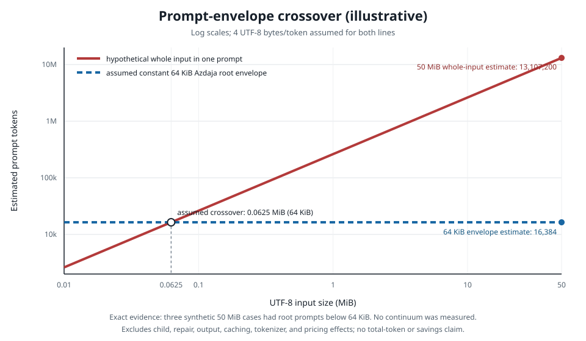

<p align="center"></p>

# Azdaja

**Virtual memory for language models: analyze inputs beyond one context window through a bounded model-facing surface and a local evaluator that retains the complete UTF-8 source.**

## What it is

Azdaja is a recursive language model layer, not a model or agent harness. It keeps the source in one persistent sandboxed Monty/Python evaluator at the root:

1. Load the complete input into the evaluator once.
2. Use code for exact parsing, filtering, grouping, and reduction.
3. Send selected semantic work through `llm` or `llm_batch`, verify coverage, and return `FINAL`.

What makes it different:

- **Context virtualization:** the root works through variables and computed excerpts instead of receiving the complete source in every request.
- **Deterministic reduction:** Python handles exact operations before the model handles ambiguous language.
- **Bare recursion:** subcalls are model calls rather than new agent environments.
- **Measured memory:** the local console distinguishes resident source, session state, measured model-boundary evidence, and unknown coverage instead of inventing a generic context score.
- **Tool adapters:** one managed integration supports Jcode, Claude, Codex, Gemini, and OpenCode. Every profile is rendered from the same default skill contract with tool-specific activation, execution, and reload guidance.

## Install

The curl installer adds the standalone command, detects supported tool executables, and prompts you to choose integrations. It distinguishes a tool being found from an Azdaja integration being active, shows exact destinations before mutation, and prints named download, verification, staging, and write phases. Pass `--all` for an unattended install of every integration. It never calls a model provider. It supports Apple Silicon macOS 11+ and x86-64 Linux with glibc 2.35 or newer.

```bash
curl -fsSL https://azdaja.dev/install | sh
```

The stable `azdaja.dev/install` URL serves the current published installer. Its versioned release payloads are fetched from `azdaja.dev` and verified against `SHA256SUMS` before installation.

Alternatively, install from source with Rust 1.95:

```bash
cargo install --git https://github.com/kubet/azdaja.git --tag v0.1.4 --locked
```

`azdaja` is the canonical command. The curl installer adds `az` only when that name is free; Cargo installs `azdaja` only.

`az install` finds supported tools automatically. To target one tool, run `az install jcode`; to install every integration, run `az install all`. Then run the exact `az doctor` command printed by install before reloading the tool. See [edge cases and lifecycle details](docs/install.md) for platform checks, registry reloads, configuration paths, Cargo setup, and safe removal.

Standalone binaries require exact co-distribution of `LICENSE`, matching `SHA256SUMS`, and the [supported-target third-party notices](THIRD-PARTY-NOTICES.md).

Choose one removal scope:

```bash
az uninstall jcode
az uninstall standalone
az uninstall all
```

## Use

Run `azdaja` with no arguments in a terminal for the provider-free virtual-memory console. It refreshes validated owner-only state, shows the configured route, resident aggregate source size, session state, a positional memory map, and recent work, and labels unmeasured boundary or coverage data instead of displaying a fake zero. Details include exact-local source texture such as byte entropy without storing source text, paths, prompts, responses, or hashes. Press `q`, Esc, or Ctrl-C to leave; narrow terminals fall back to plain lines.

Ask one question about one input:

```bash
az solo "question about this input" -f ./large.txt
```

Or use an explicit evaluator session:

```bash
sid=$(az start)
az load "$sid" ./large.txt ctx
printf '%s\n' 'FINAL(len(ctx))' | az exec "$sid"
az final "$sid"
az kill "$sid"
```

Commands: `help`, `solo`, `install`, `doctor`, `start`, `load`, `exec`, `final`, `list`, `kill`, and `uninstall`.

See the [CLI reference](docs/cli.md) for signatures, process custody, signal behavior, temporary files, and configuration errors.

## Results

A fixed 199-row Oolong diagnostic under the RAH protocol ([arXiv:2606.13643](https://arxiv.org/abs/2606.13643)) produced 185 valid predictions; the 14 failures stayed in the denominator as zeros. The [terminal receipt](bench/results/gpt-rah199-mortality-v3-terminal-public.json) records the frozen accounting, and the [public manifest](bench/results/rah199-public-manifest.json) pins every fixture by hash.

| Source | System | Class | Score |
|---|---|---|---:|
| RAH paper | RLM | Model recursion without agent tools | **64.38%** |
| This repo | Azdaja | Bare RLM layer | **68.64%** |
| RAH paper | Codex, No Retriever | Coding agent | **71.75%** |
| RAH paper | RAH, GPT-5 | Recursive agent harness | **81.36%** |

*Single-arm diagnostic under the paper's protocol; paper controls were not rerun.*

Within this four-row ladder, Azdaja is **4.26 percentage points** above the paper's RLM reference and remains below the two agent configurations shown. How these numbers were earned — and everything that died along the way — is in the [launch saga](docs/launch-saga.md).

## Cost

- **Same-model projection diagnostic:** on one frozen synthetic 1.3 MiB classification task, GPT-5.6 Luna through Azdaja returned the same exact answer as the native harness while using **66.7% fewer uncached tokens and 54.8% less wall time on Codex**, and **88.0% fewer uncached tokens and 63.7% less wall time on OpenCode**. This was a candidate-only follow-up against hash-bound native rows, not a concurrent or repeated benchmark ([plan, limits, and exact receipt](bench/delta/README.md)).
- **Constant root economy:** across 198 measured RAH rows, the mean was **5,403 root tokens per item** while representative bucket medians spanned **78,842** to **9,927,812 input characters**; `load` returned only character and line metadata, never source content ([cost receipt](bench/results/cost-evidence-public.json)).
- **50 MiB proof:** the [in-repo test](tests/product_50mb.rs) answered three exact **52,428,800-byte** inputs in one root turn each, with zero child calls, a root prompt below **65,536 bytes**, and a **90-second** watchdog ([acceptance receipt](bench/results/v0.1.2-product-acceptance-public.json)).
- **Wall-clock shape:** across 123 sealed diagnostic rows in eight input-size buckets from **32,768 to 4,194,304 tokens**, bucket-median wall time was non-monotonic, with a descriptive slope of **-0.43 seconds per input doubling** ([cost receipt](bench/results/cost-evidence-public.json)).
- **Zero exact-overlap hits:** across **649 distinct scans with surviving structured assertions**, checks for exact input substrings of at least **100 characters** produced **zero matches** ([scan receipt](bench/results/cost-evidence-public.json)).
- **Measured subscription route:** the default Jcode/OpenAI path used subscription OAuth, requested no separate API key, and failed closed before a model turn when that route was unavailable ([cost receipt](bench/results/cost-evidence-public.json)).

<p align="center"></p>

## Boundaries

- Model-authored code can select source material for a model call; bounded context is not information-flow control.
- The CLI reads user-supplied paths, and selected context can be sent to the configured provider.
- Native host tools keep the user's permissions; stronger containment requires a separate trusted inference broker.
- Monty 0.0.21 is experimental and snapshot-format-bound. Snapshots are unencrypted owner-only files, and evaluator memory has no configured ceiling.
- Use synthetic or sanitized issue reproductions. Never post raw inputs, traces, configuration, host paths, OAuth material, tokens, or secrets.

## Validate

```bash
cargo test --all --locked -- --test-threads=1
cargo build --release --locked
AZDAJA_PRODUCT_BINARY=target/release/azdaja cargo test --release --locked --test product_50mb offline_scripted_harness_answers_three_real_world_50_mib_files_without_a_death -- --ignored --exact --test-threads=1
cargo clippy --all-targets --all-features --locked -- -D warnings
```

## License

Azdaja is [MIT licensed](LICENSE). Licenses and attributions for dependencies reachable on the supported targets are reproduced in [THIRD-PARTY-NOTICES.md](THIRD-PARTY-NOTICES.md), and the bundled Cormorant Light font retains its [OFL](site/fonts/Cormorant-Garamond-OFL.txt). Release packaging and managed-file invariants are documented in [Internals](docs/internals.md).
