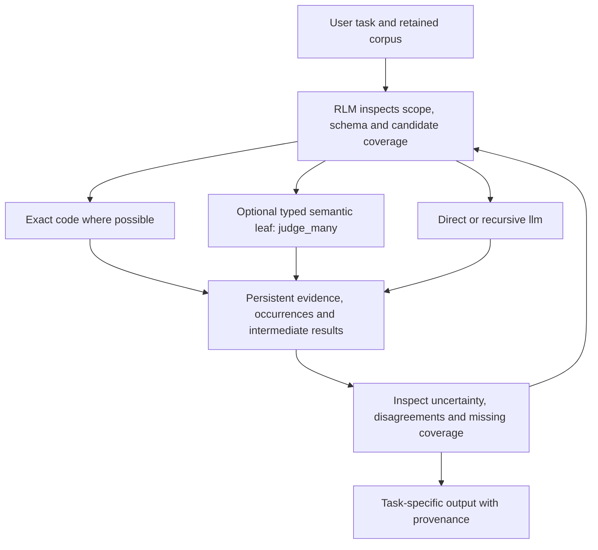

# Jev × Azdaja: angle of attack and decision, 2026-09-17

## One-paragraph product logic

**Make Jev an optional typed semantic worker inside Azdaja's programmable context, not a compulsory judge or another search product.** The RLM inspects the task and data, uses ordinary code for exact work, optionally calls `judge_many` for repeated semantic decisions, keeps the original evidence and complete returned distributions, and uses `llm` where interpretation or synthesis is still needed. Reranking is one application; extracting exact source values, comparing records, finding conflicting evidence and testing alternative execution strategies are others. The defensible hypothesis is better control over *which work needs inference and which state can be reused*, not magic accuracy from typed output or an automatic quadratic-to-linear claim. Current tests prove the optional execution boundary works, but do not establish an RLM moat or a quality-preserving Jev replacement.

## The useful control flow

The loop is a product direction, not proof that autonomous planning already improves quality. The delivered native interfaces are `judge_many(state, questions)` and `judge_stats()` alongside `llm`. Query decomposition, source-span candidate generation, joining and output materialization in these experiments are ordinary authored control code. There is no shipped native semantic SQL engine, automatic plan optimizer, execution DAG, or general backend-plugin framework. TypeSafe transport is compile-time optional and runtime disabled by default. Existing `llm`/code workflows need no TypeSafe key.

## Angles, cheapest counterfactuals and actual evidence

| Angle | Concrete useful output | Strong counterfactual / failure bar | Evidence today |
|---|---|---|---|
| Retrieval and reranking | Small evidence set that still covers decisive sources | More cheap lexical candidates, passage normalization, MMR and matched final answer quality | One Q1 top-four source-coverage signal, but top-eight cheap retrieval covered all 18 required groups across seven tasks. No final-answer gain demonstrated. |
| Exact-source selection and extraction | Correct source-backed structured table, preserving occurrence identity | Same generative model selects IDs from the same candidates, with the same deterministic copy | **Actual native:** Jev 17/18 vs generative 18/18. Median block latency 1.162s vs 2.529s. Faster, but failed the predeclared no-quality-loss bar. |
| Entity resolution / semantic joins | Correct entity links with duplicates and unresolved pairs accounted for | Direct pairwise evaluation on the identical pair universe; simple blocking plus Python cache | Provider-free factorization mechanism only. A supplied factorability contract can save repeated questions. Feature collisions and accepted unary errors can destroy pair accuracy. No live Jev advantage measured. |
| Evidence conflicts / task memory | Relevant competing claims, source dates and disagreements, without overwriting originals | File-aware lexical recall plus direct `llm`; measure downstream task success, not number of memories stored | Fits the optional `.azdaja` memory direction. No Jev memory-quality benefit established. Never treat model confidence as authority to erase a source or merge disagreement. |
| Repeated extraction / ETL under format drift | Typed records with exact copied fields, explicit missing coverage and recoverable failed partitions | Deterministic parser, direct model extraction, then an independently tested residual policy | Source selection is a small first mechanism. Real drift robustness, restartability and bulk economics are not tested. |
| Adaptive orchestration / cascades | Same final quality with fewer costly inference operations on heterogeneous workloads | Same RLM plus an ordinary API wrapper, Python loops/cache and identical models/prompts | Research-backed substrate hypothesis, not delivered comparative advantage. Must measure end-task quality, bytes, calls, latency and repair cost separately. |
| Broad semantic critic / acceptance oracle | Fewer incorrect final answers or harmful source omissions | Direct source-backed generative answer without the extra critic | Seven-task live developer-answer study found no gain. Do not add it as a mandatory gate. |

## What the newest end-to-end result actually teaches

The [source-selection study](../../bench/jev/span_selection/RESULTS.md) used real native calls and completed every row. Jev correctly selected all 12 literal values and five of six missing/ambiguous results. It confused `ambiguous` with `no_match` on the final task, while the matched generative selector got all 18 correct. Its full distribution and source remained available for inspection. No threshold, extra repair call or question rewrite was applied after seeing that failure.

That is a **latency/quality tradeoff**, not a win. A residual-routing policy is plausible future work, but choosing its cutoff from this single error and replaying the same panel would not validate it. Such a policy needs its own predeclared development/held-out split, equal baseline opportunity and final-output bar. This completed screen does not justify rerunning the same panel until a favorable result appears.

## Preserve uncertainty rather than enforcing arbitrary policy

- Keep all source candidates and their occurrences. A candidate generator can omit the right value, even when every returned judgment is well typed.
- Preserve full typed distributions and disagreements. Do not silently threshold them into truth or deletion.
- Keep `no_match`, `ambiguous`, `not_covered`, unjudged, transport failure and budget stop distinct.
- Leave escalation and acceptance to the calling task, with an explicitly tested policy. The engine should enforce resource/security/shape contracts, not unvalidated semantic certainty.
- Cache exact observations, not eternal accepted booleans. Current native cache/accounting is per cell, while ordinary variables can persist across cells.
- A provider-reported model string is consistency evidence, not authenticated backend weights or independent evidence from cache hits.

## Decision

Keep the native typed leaf experimental and optional. Preserve the direct `llm` and deterministic paths. Do not market general quality improvement, cheaper dollars, an automatic planner, or an RLM-specific computational advantage. The two live useful-output studies have not met a promotion bar. The next *research priority*, if separately pursued, is a matched residual-orchestration study on heterogeneous real workloads, not another generic critic or a reranker benchmark with a weak lexical baseline.

Primary-source grounding and limitations remain in [the research evidence dossier](jev-primary-evidence-20260916.md). LOTUS, Palimpzest, DocETL, Abacus and EVAPORATE already cover many operators, cascades and optimizer ideas. RLM supplies programmable context and recursive control, but composing established pieces is an experimentally testable product hypothesis, not novelty established by naming them.
