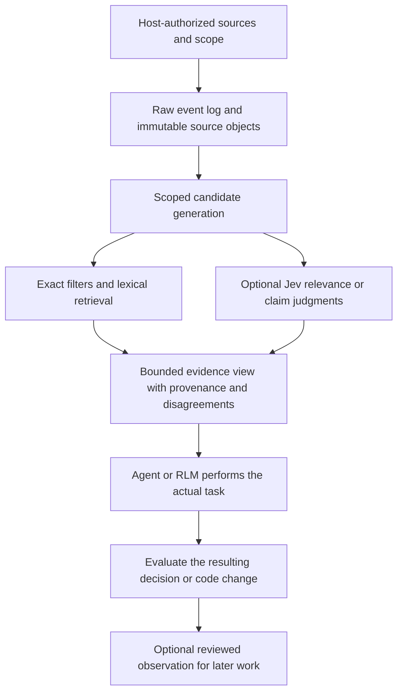

# Shared agent wisdom: explicit evidence, optional semantic work

## Decision boundary

Do not build a global, automatically injected summary blob. Keep raw evidence
available and let a caller explicitly construct a task-specific view. An RLM can
operate on large external state, but neither RLM nor Jev supplies infinite attention,
automatic completeness, calibrated truth, or a proven SOTA reranker.

The executable prototype is `bench/jev/angle_lab/memory`. It is a controlled
synthetic handoff, not a production memory migration or a multiuser service. The
existing user-authored `az memory` ledger and its opt-in policies are unchanged.
The other five experiment lanes remain independent of this memory direction.

## Representation

1. **Canonical evidence:** exact UTF-8 text or original bytes, source content hash,
   revision/observation time, and a stable occurrence/event ID. Keep duplicate
   occurrences even if content is stored once. Never replace the only original
   with a summary, embedding, model-selected label, or a winner's probability.
2. **Attribution:** separate actor, repository, worktree, session and event IDs.
   Git name/email/commit are useful asserted provenance. They are not authenticated
   actor identity, globally unique keys, access rights or proof of execution.
   Two people can share a Git email. One person can change it. Link identities only
   through an explicit trusted mapping, not a heuristic merge.
3. **Structured observations:** distinguish observation, proposal, hypothesis,
   decision, failure and disagreement. Each points to raw source spans/revisions.
   Preserve alternatives, supersession and minority evidence. Agent extraction is
   an agent-derived proposal, not silently relabeled user-authored memory.
4. **Disposable indexes:** exact file/revision associations, lexical postings and
   optional embeddings or typed judgments. RLM is an execution model, not an
   embedding format. Embeddings can help candidate coverage but are not required
   for canonical storage and must be reproducible from retained sources.

## Explicit retrieval and execution

Scope filtering precedes candidate generation, provider prompts, caching and
tracing. A retrieved note cannot authorize another repository, increase a budget,
select a shell command or supply a network endpoint. Cache identity includes exact
submitted state, question/criteria/schema, backend identity and authorized scope.
Acceptance policy is a separate derivation. A threshold change must not reuse an
old accepted boolean. Cache hits are not independent corroboration.

Reranking a narrow lexical shortlist cannot recover evidence omitted from that
shortlist. Measure candidate recall separately from ordering and from the next
agent's final work. Preserve a bounded disagreement/context channel, with explicit
omissions when it does not fit. Do not use diversity or entropy as a generic
quality score or force uncertain notes into one authoritative answer.

## Several people, repositories and machines

The proposed durable layout is a repo-scoped append-only event stream plus
content-addressed source objects, with per-actor/session append segments and
rebuildable indexes. Stable repository identity must survive a path rename, while
clones/remotes merge only by explicit mapping. A matching directory basename or
self-declared repository ID is insufficient. A host-owned authorization registry,
not repository content, defines what can be read or shared.

Multi-writer append, atomic index publication, deduplication and replay ordering
need real concurrency/crash tests before production use. Cross-machine replication
also needs an authenticated identity and authorization design. Neither a local
0600 file nor a JSON actor ID implements that service. Sharing/export must be
explicit and reviewed for private material, including linked context. Deletion,
retention and revocation must invalidate derived indexes/caches as well as views.

The current 1k/10k prototype exercises unique event IDs, 31 repository partitions,
visibility filtering and local index/query work. It does not validate million-event
semantic quality, synchronization, malicious multi-tenant containment, or deployed
team productivity. No live user logs were ingested for the synthetic fixture.

## Evaluation and promotion

- Hold candidate universe and maximum evidence bytes constant across lexical and
  Jev-assisted views. Log scope exclusions and all omitted source IDs.
- Send the actual selected view to a new task call. Score its decisions, source
  support, uncertainty handling and attribution, not just ranking metrics.
- Keep final code/task completion separate from a structured synthetic decision.
- Compare against a competent lexical/full-context control and a plain Python
  cache using the same models. Additional indexes earn complexity only through
  measured benefit, not through low provider price or larger storage capacity.
- Promote no automatic ingestion, global merge or mandatory semantic route from a
  single synthetic win. Negative earlier final-answer and span-selection studies
  remain part of the evidence.

Primary-source context and prior art are catalogued in
[the research evidence](jev-primary-evidence-20260916.md) and
[the engine design](jev-engine-design-20260916.md). Semantic operators, cascades,
materialized views and Choice trees are prior art. The remaining hypothesis is
whether their measured composition over retained task evidence improves real work.
